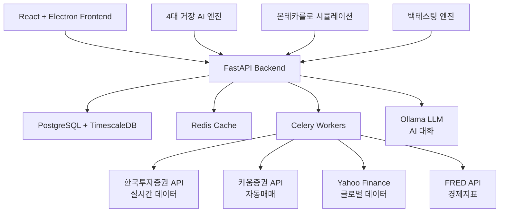

# 📊 Master’s Eye

**4대 거장 융합 주식 AI 포트폴리오 시스템**

워렌 버핏, 레이 달리오, 리처드 파인만, 짐 사이먼스의 투자 철학을 융합한 AI 기반 자동화 투자 플랫폼


## 🎯 프로젝트 개요

Master’s Eye는 투자계의 4대 거장의 철학을 AI로 융합하여 최적의 포트폴리오를 생성하고 관리하는 혁신적인 시스템입니다.

### 🏛️ 4대 거장의 철학

- **💡 워렌 버핏**: 가치 투자 철학 (내재가치, 경제적 해자, 안전마진)
- **🌊 레이 달리오**: 거시경제 & All Weather 전략 (경제 사이클, 리스크 패리티)
- **🔬 리처드 파인만**: 과학적 사고 & 불확실성 정량화 (몬테카를로, 베이지안 추론)
- **📐 짐 사이먼스**: 퀀트 & 패턴 인식 (멀티팩터, 머신러닝, 시장 이상현상)

### ✨ 주요 기능

- 🤖 **AI 대화형 포트폴리오 조정**: “삼성전자 대신 다른 종목으로 바꿔줘”
- 📊 **실시간 시장 데이터**: 한국투자증권 API 연동
- 🔄 **자동매매 시스템**: 키움증권 API 연동
- 📈 **백테스팅 & 몬테카를로 시뮬레이션**: 과거 성과 검증 및 미래 예측
- 👥 **개인화된 UI**: 초보자(엄마)와 중급자(나) 맞춤 인터페이스

## 🚀 빠른 시작

### 📋 사전 요구사항

- **Python 3.11+**
- **Node.js 18+**
- **Docker & Docker Compose**
- **한국투자증권 계좌** (API 키 발급용)
- **키움증권 계좌** (자동매매용, 선택사항)

### ⚡ 5분 설치 가이드

#### 1. 저장소 클론

```bash
git clone https://github.com/your-username/masters-eye.git
cd masters-eye
```

#### 2. 환경 설정

```bash
# 환경 변수 파일 생성
cp .env.template .env

# 필수 환경 변수 설정 (에디터로 .env 파일 편집)
# - KIS_APP_KEY: 한국투자증권 App Key
# - KIS_APP_SECRET: 한국투자증권 App Secret
# - KIS_ACCOUNT_CODE: 계좌번호 앞 8자리
# - KIS_PRODUCT_CODE: 계좌번호 뒤 2자리
```

#### 3. 백엔드 시작

```bash
# Docker 컨테이너 실행
docker-compose up -d

# 백엔드가 준비될 때까지 대기
curl http://localhost:8000/health
```

#### 4. 프론트엔드 설치 & 실행

```bash
cd frontend
npm install
npm start

# Electron 앱 실행 (별도 터미널)
npm run electron-dev
```

#### 5. 접속 확인

- **웹 브라우저**: http://localhost:3000
- **Electron 앱**: 자동으로 실행됨
- **API 문서**: http://localhost:8000/docs

## 🏗️ 시스템 아키텍처

